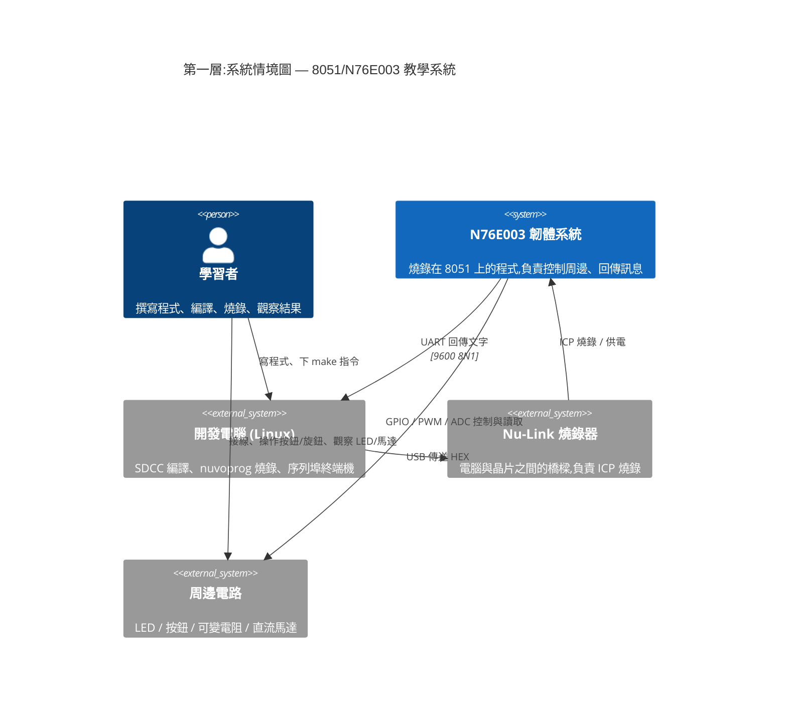
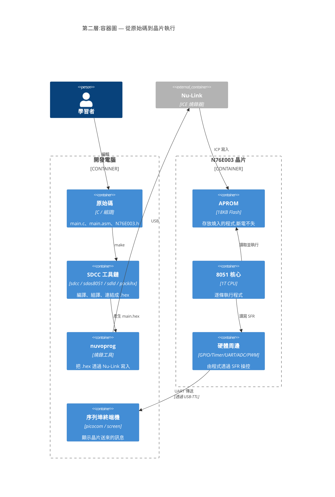
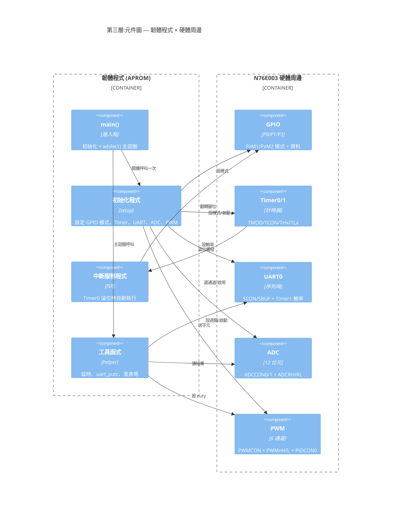
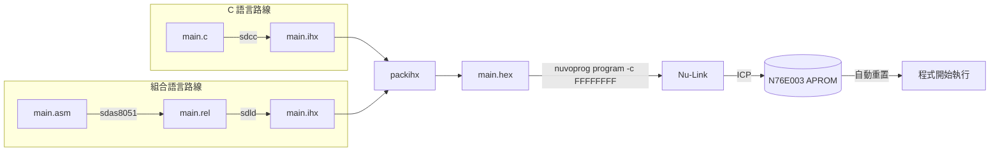
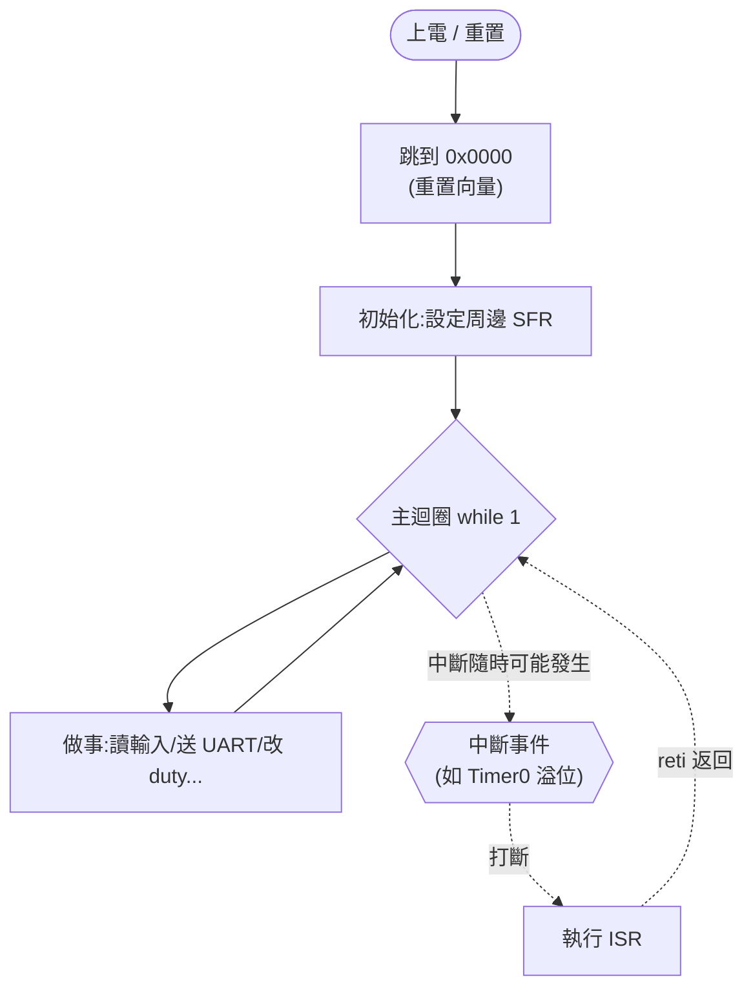
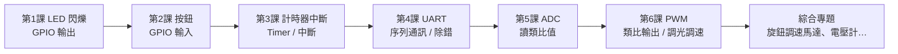
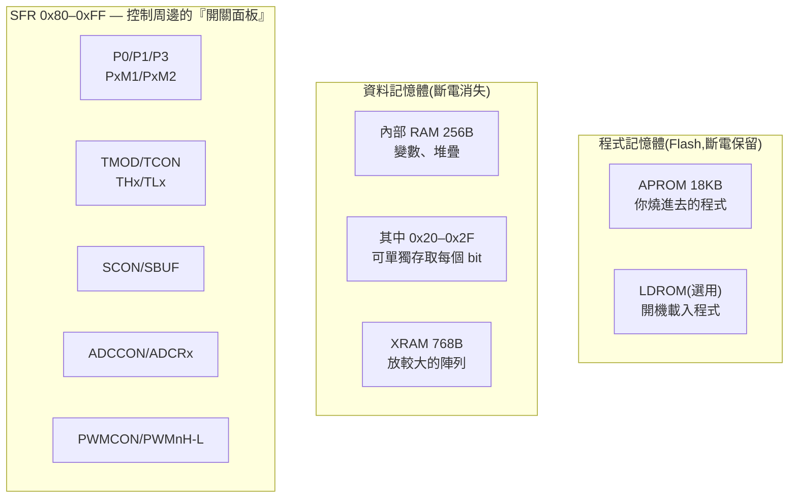
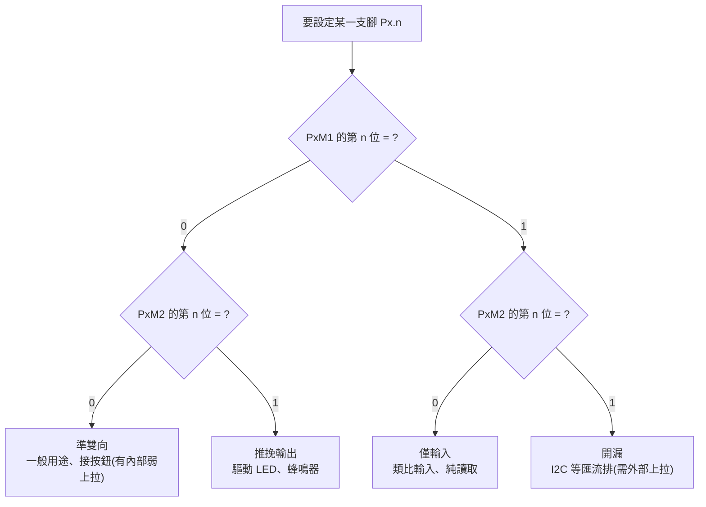
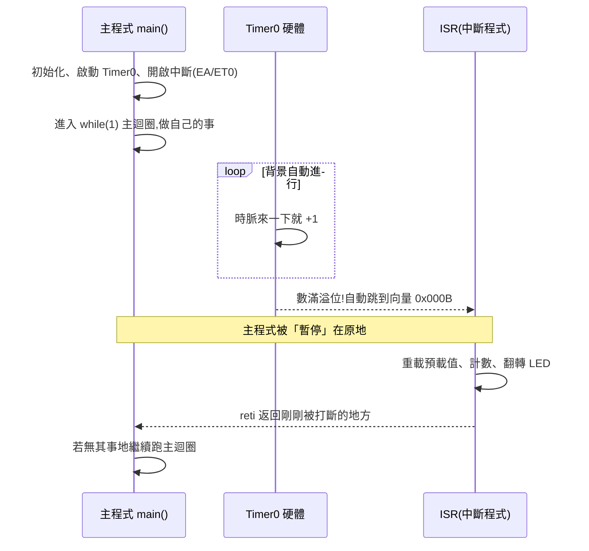

# 第 10 章:系統架構圖(C4 Model)

> 這一章用 [C4 Model](https://c4model.com/) 的分層方式,搭配 **Mermaid** 圖,
> 從「最外層的整體情境」一路畫到「晶片內部的元件」,幫你建立對整個系統的全貌感。
>
> C4 由外而內分四層:**Context(情境)→ Container(容器)→ Component(元件)→ Code(程式碼)**。
> 本章呈現前三層,最細的 Code 層就是各課的原始碼本身。
>
> 📌 這些圖使用 Mermaid 繪製,GitHub 與 VS Code(裝 Mermaid 外掛)皆可直接顯示。
> C4 圖(10.1~10.3)需要支援 C4 的 Mermaid 版本;萬一你的檢視器沒顯示,可改看
> 10.4~10.6 以一般 flowchart / 時序圖繪製的圖,它們涵蓋相同的系統結構與觀念。

---

## 10.1 Level 1 — 系統情境圖 (System Context)

**看點**:誰在用這個系統?它和外界(開發電腦、燒錄器、周邊、使用者)怎麼互動?

---

## 10.2 Level 2 — 容器圖 (Container)

**看點**:把「開發電腦」和「N76E003 晶片」各自拆開,看裡面有哪些主要組成,以及
一支程式從原始碼變成晶片裡執行的程式,中間經過哪些「容器」。

---

## 10.3 Level 3 — 元件圖 (Component)

**看點**:聚焦在「韌體程式」與「晶片周邊」兩塊,看我們的程式由哪些邏輯元件組成,
它們又各自對應到哪個硬體周邊(以及背後的 SFR)。

> 對應關係:每一課其實就是在練習「`init` 設定某個周邊 → `main`/`isr` 操作它」。
> 例如第 3 課 = 設定 Timer0 + 寫 Timer0 的 ISR;第 6 課 = 設定 PWM + 在主迴圈改 duty。
>
> 📌 第 7 課則把這個骨架再往上抽一層:中間多一塊**完全不碰硬體的狀態機**,
> 變成「輸入層 → 狀態機 → 輸出層」三層。那張圖與理由見
> [`11-狀態機.md`](11-狀態機.md) §11.5。

---

## 10.4 補充圖 A:建置與燒錄工具鏈(flowchart)

一支程式從原始碼到在晶片上跑,經過的每一關:

---

## 10.5 補充圖 B:韌體執行流程(flowchart)

幾乎每一課的程式都是這個骨架 —— 開機初始化一次,然後永遠跑主迴圈;
有用到中斷的課(如第 3 課),中斷會「插隊」執行 ISR 再回到主迴圈:

---

## 10.6 給初學者的四張理解圖

下面這幾張圖,專門用來打通初學最容易卡住的觀念。

### A. 課程學習地圖 — 六課怎麼堆疊上去

每一課都在前一課的基礎上多學一項能力,最後能組合成綜合專題:

> 輸出(1課)→ 輸入(2課)→ 時間(3課)→ 通訊(4課)→ 類比讀(5課)→ 類比控(6課)。
> 六項湊齊,幾乎能做出任何感測+控制的小專案。

### B. N76E003 記憶體地圖 — 程式與變數各住哪裡

這是初學最容易混的觀念:**程式燒在 Flash(不會消失),變數跑在 RAM(斷電消失)**。

### C. GPIO 模式決策圖 — PxM1 / PxM2 怎麼決定一支腳

一支腳要設成哪種模式,由 `PxM1`、`PxM2` 對應那一位共同決定。照這張圖走就對了:

### D. 中斷互動時序圖 — main 與 ISR 怎麼「同時」工作

第 3 課最難想像的就是「中斷」。這張時序圖把 main、計時器硬體、ISR 的互動畫出來:

> 關鍵體會:main 和 ISR 看起來像「同時」在跑 —— 計時交給硬體 Timer,時間到才用中斷
> 叫一下 CPU。這就是嵌入式能一邊閃燈、一邊讀按鈕、一邊送 UART 的祕訣。

---

## 10.7 小結

- **Context**:學習者透過開發電腦 + Nu-Link,把程式送進 N76E003,晶片再去控制周邊、回傳訊息。
- **Container**:原始碼經 SDCC → `.hex` → nuvoprog → Nu-Link → APROM;晶片核心讀 APROM 執行、操控周邊。
- **Component**:韌體的 `main / init / isr / util` 透過 SFR 操作 GPIO/Timer/UART/ADC/PWM 各周邊。

把這三張圖記在腦中,再回頭看每一課的程式,就會很清楚「這段碼在整個系統的哪個位置」。

---

[⬅ 回到首頁 README](../README.md)
