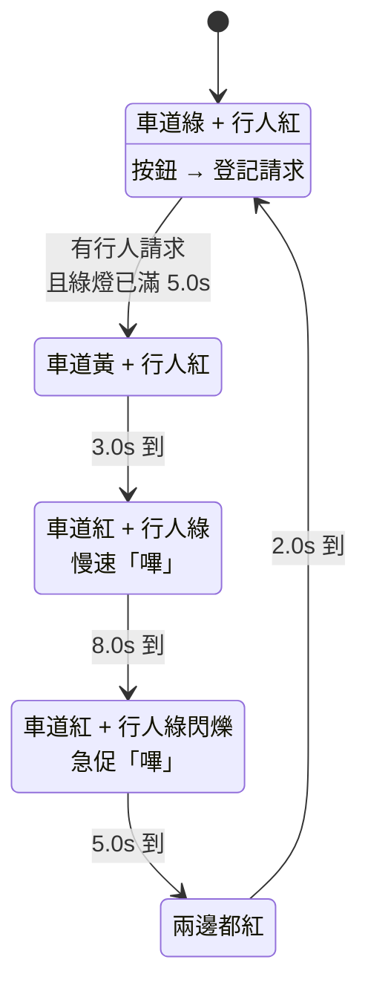
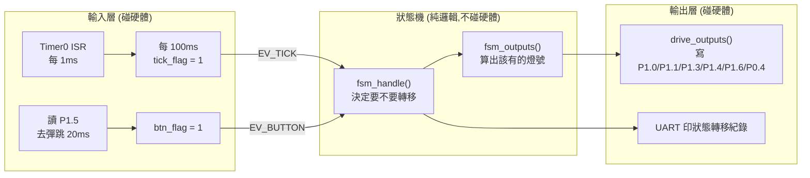

# 第 11 章:有限狀態機 (FSM) ─ 讓韌體不再是一團麵條(對應第 7 課)

> 對應範例:[`c/07-fsm`](../c/07-fsm/)
> 目標:學會用「狀態 + 事件 + 轉移」來組織韌體,並親手比較它與「一堆 delay 的
> 無窮迴圈」差在哪裡。
>
> 💡 這一章**不需要開發板也能全部學完** —— 範例附了一個在電腦上跑的模擬器。

---

## 11.1 問題:程式長大之後會變成一團麵條

前 6 課每一課都很短,所以「開機設定一次 → `while(1)` 裡做一件事」就夠用。
但真實的韌體通常要同時應付好幾件事。以這一章的情境為例:

> 一個路口:平常車道綠燈。行人按按鈕申請過馬路,號誌要走完
> 黃燈 → 行人通行 → 綠燈閃爍催促 → 全紅淨空,再回到車道綠燈。
> 而且車道綠燈**至少要維持 5 秒**,免得車流被一直打斷。

如果照前幾課的寫法,很自然會寫成這樣:

```c
void main(void)
{
    while (1)
    {
        set_lights(VEH_GREEN);   delay_ms(5000);
        wait_for_button();                        /* ← 卡在這裡等 */
        set_lights(VEH_YELLOW);  delay_ms(3000);
        set_lights(PED_WALK);    delay_ms(8000);
        for (i = 0; i < 10; i++) {                /* 閃爍 5 秒 */
            set_lights(PED_FLASH_ON);  delay_ms(250);
            set_lights(PED_FLASH_OFF); delay_ms(250);
        }
        set_lights(ALL_RED);     delay_ms(2000);
    }
}
```

這段程式**看起來**很好懂,也真的能跑。問題在於:

1. 行人在車道綠燈的第 1 秒按按鈕 → 那時 CPU 正卡在 `delay_ms(5000)` 裡,
   **按壓完全不會被看到**,行人會按了半天沒反應。
2. 想順便讓蜂鳴器「嗶」、順便用 UART 印除錯訊息、順便再管第二個路口?
   每個 `delay_ms()` 都得挖開來,把別的事情硬塞進去。塞到第三件事,
   這個函式就沒人看得懂了。
3. 問一個簡單的問題:「現在是什麼狀態?」—— **程式裡沒有任何變數能回答**。
   狀態只存在於「程式指標現在停在哪一行」,你沒辦法把它印出來、
   沒辦法存起來、沒辦法測試。

狀態機就是為了解決這三件事。

---

## 11.2 狀態機是什麼?四個名詞就講完了

**有限狀態機 (Finite State Machine, FSM)**:系統在任何時刻都處於**有限個**
明確定義的「狀態」之一;外界發生「事件」時,依照「轉移規則」換到下一個狀態。

| 名詞 | 意思 | 本課的例子 |
|------|------|-----------|
| **狀態 (State)** | 系統現在在哪個階段 | 車道綠燈、車道黃燈、行人通行、行人催促、全紅淨空 |
| **事件 (Event)** | 從外界進來的輸入 | 時間過了 100ms(`EV_TICK`)、行人按下按鈕(`EV_BUTTON`) |
| **轉移 (Transition)** | 「在 A 狀態收到 X 事件 → 換到 B 狀態」 | 黃燈狀態收滿 30 個 tick → 換到行人通行 |
| **動作 (Action)** | 轉移時或待在某狀態時要做的事 | 進入新狀態時把計時歸零;行人通行時點綠燈、慢速嗶 |

再加兩個很有用的概念:

- **守衛條件 (Guard)**:轉移要成立的**附加條件**。本課:「有人按過按鈕」**而且**
  「綠燈已經亮滿 5 秒」才轉移 —— 兩個條件缺一不可。
- **不變式 (Invariant)**:不管在哪個狀態都必須成立的規則。本課最重要的是
  「車道綠燈和行人綠燈**絕對不可以同時亮**」(§11.9 會把它寫成測試)。

---

## 11.3 ⭐ 兩種架構的正面對照

這一節是本章的核心。同一個需求,左邊是「無窮迴圈 + delay」(又叫**阻塞式**、
**順序式**寫法),右邊是狀態機。

### 11.3.1 程式長相

**A. 無窮迴圈(阻塞式)**

```c
while (1)
{
    set_lights(VEH_GREEN);
    delay_ms(5000);            /* ← 這 5 秒 CPU 什麼都做不了 */
    wait_for_button();         /* ← 卡住,直到有人按 */
    set_lights(VEH_YELLOW);
    delay_ms(3000);            /* ← 又卡 3 秒 */
    ...
}
```
時間的流動 = **程式指標往下走**。狀態藏在「跑到第幾行」裡。

**B. 狀態機(事件驅動、非阻塞)**

```c
while (1)
{
    if (btn_flag)  { btn_flag  = 0; fsm_handle(&m, EV_BUTTON); }
    if (tick_flag) { tick_flag = 0; fsm_handle(&m, EV_TICK);
                     fsm_outputs(&m, &out); drive_outputs(&out); }
    /* 迴圈永遠跑得很快,隨時可以插進別的工作 */
}
```
時間的流動 = **Timer 中斷送進來的 `EV_TICK` 事件**。狀態明明白白放在 `m.state`。

### 11.3.2 關鍵差異逐項對照

| 比較項目 | 無窮迴圈 + delay | 狀態機 |
|---------|-----------------|--------|
| **狀態存在哪裡** | 隱含在「程式跑到第幾行」 | 明確存在一個變數 `m.state` |
| **對輸入的反應速度** | 最糟 = 最長的那個 delay(本例 5 秒) | 最糟 = 一個 tick(本例 0.1 秒) |
| **delay 期間的 CPU** | 空轉,什麼都不能做 | 沒有 delay,CPU 隨時有空 |
| **同時做第二件事** | 很難:要把新工作塞進每個 delay 裡 | 容易:在主迴圈旁邊加一段 `if` 就好 |
| **加一個條件(如最短綠燈)** | 常要把流程打散重寫 | 在對應 `case` 加一行守衛條件 |
| **能不能印出/記錄狀態** | 不行,沒有東西可印 | 可以,`fsm_state_name(m.state)` |
| **能不能在電腦上測試** | 幾乎不行(與 delay、硬體綁死) | 可以,純邏輯 → gcc + assert(§11.9) |
| **出 bug 時怎麼查** | 單步追一長串函式呼叫 | 看 UART 印出的「狀態轉移紀錄」 |
| **程式行數(本例)** | 短(約 15 行) | 長(約 60 行 + 介面定義) |
| **初學者第一眼的理解難度** | 低,照著讀就懂 | 中,要先接受「事件驅動」的思考方式 |
| **狀態一多時** | 完全失控 | 仍可控,但狀態太多需要「階層狀態機」(§11.12) |
| **需不需要時間基準** | 不需要 | 需要:得先有 Timer 中斷產生 tick(第 3 課) |

### 11.3.3 各自的優缺點與適用時機

**無窮迴圈 + delay**
- ✅ 優點:直覺、程式短、不需要 Timer、流程讀起來就是「照順序做」。
- ❌ 缺點:阻塞(delay 期間聾了瞎了)、無法同時做多件事、狀態不可觀測、
  難測試、需求一變就要重寫。
- 👍 **適合**:只做一件事且不必即時反應的小程式 —— 本教材第 1 課的 LED 閃爍、
  第 4 課每秒印一行,用它完全合理,**不必為了用狀態機而用狀態機**。

**狀態機**
- ✅ 優點:非阻塞、反應快、狀態可觀測可記錄、規則集中在一個 `switch`、
  容易擴充、純邏輯可在電腦上模擬與單元測試。
- ❌ 缺點:樣板程式比較多、要自己維護時間基準、要換一種思考方式、
  狀態數量爆炸時仍會複雜(得再分層)。
- 👍 **適合**:要同時應付「時間」和「使用者輸入」的系統 —— 號誌、
  洗衣機/電鍋行程、充電器的充電階段、通訊協定解析、選單介面、
  馬達的啟動/加速/保護流程。幾乎所有「像個產品」的韌體都長這樣。

> 📌 還有第三種做法:用 **RTOS** 開好幾個執行緒,各自 `sleep()`。
> 那是把「排程」交給作業系統,寫起來像 A 一樣順,又不會互相阻塞。
> 但 N76E003 只有 256B 內部 RAM,塞 RTOS 太勉強;
> **在小型 8051 上,狀態機幾乎就是標準答案。**

---

## 11.4 本課的狀態機設計

### 狀態圖



### 狀態轉移表(真正該先畫的東西)

寫狀態機之前,先把這張表畫出來,程式就幾乎是照抄:

| 目前狀態 | 收到 `EV_TICK` | 收到 `EV_BUTTON` |
|---------|---------------|-----------------|
| **車道綠燈** | 計時 +1;若「有請求 **且** 計時 ≥ 50」→ **車道黃燈** | 還沒登記 → 登記請求(`記下請求`)<br>已登記 → `忽略事件` |
| **車道黃燈** | 計時 ≥ 30 → **行人通行** | `忽略事件` |
| **行人通行** | 計時 ≥ 80 → **行人催促** | `忽略事件` |
| **行人催促** | 計時 ≥ 50 → **全紅淨空** | `忽略事件` |
| **全紅淨空** | 計時 ≥ 20 → **車道綠燈** | `忽略事件` |

(計時單位是 tick,1 tick = 100ms,所以 50 = 5.0 秒)

### 輸出表(狀態 → 燈號)

| 狀態 | 車道紅 | 車道黃 | 車道綠 | 行人紅 | 行人綠 | 蜂鳴器 |
|------|:---:|:---:|:---:|:---:|:---:|:---|
| 車道綠燈 | | | ● | ● | | |
| 車道黃燈 | | ● | | ● | | |
| 行人通行 | ● | | | | ● | 0.5s 慢嗶 |
| 行人催促 | ● | | | | 0.5s 閃爍 | 0.2s 急嗶 |
| 全紅淨空 | ● | | | ● | | |

> 檢查一下:**沒有任何一列同時出現「車道綠」和「行人綠」** —— 這就是 §11.2 說的
> 安全不變式,而且它可以被自動測試(§11.9)。

---

## 11.5 程式怎麼切:三層架構



這樣切有三個好處:

1. **中間那層可以搬到別的地方跑** —— 同一份 `fsm.c` 被 SDCC 編進晶片、
   也被 gcc 編成電腦上的模擬器和測試(這就是 §11.8、§11.9 能成立的原因)。
2. **換硬體只改外面兩層**:LED 改接別的腳、按鈕換成觸控、改用 I2C 擴充 IO,
   `fsm.c` 一行都不用動。
3. **出錯時知道去哪裡找**:燈號不對 → 看 `fsm_outputs()`;
   流程不對 → 看 `fsm_handle()`;按一下變成按兩下 → 看去彈跳。

---

## 11.6 逐段讀 `fsm.c`

### ① 狀態機的「記憶」只有一個結構

```c
typedef struct {
    fsm_state_t  state;    /* 目前狀態 */
    unsigned int ticks;    /* 進入目前狀態後過了幾個 tick */
    unsigned char request; /* 有沒有待處理的行人請求 */
} fsm_t;
```

整台狀態機的狀態就這 4 個位元組。想存進 EEPROM、想從 UART 印出來、
想在測試裡直接 `assert` —— 都可以,因為它是**資料**,不是「程式跑到哪」。

### ② 事件處理:唯一會改變 `state` 的地方

```c
fsm_result_t fsm_handle(fsm_t *m, fsm_event_t ev)
{
    fsm_state_t  next = m->state;        /* 預設「留在原地」 */
    fsm_result_t res  = FSM_NO_CHANGE;

    if (ev == EV_TICK && m->ticks < FSM_TICKS_MAX)
        m->ticks++;                      /* 先累積時間,再判斷時間到了沒 */

    switch (m->state) {
    case ST_VEH_GREEN:
        if (ev == EV_BUTTON) {
            if (m->request) res = FSM_IGNORED;              /* 已登記過 */
            else { m->request = 1; res = FSM_RECORDED; }     /* 記住請求 */
        }
        if (m->request && m->ticks >= T_VEH_GREEN_MIN) {     /* 守衛條件 */
            m->request = 0;
            next = ST_VEH_YELLOW;
        }
        break;
    /* ... 其餘狀態都是「時間到就往下走,按鈕一概忽略」 ... */
    default:
        next = ST_VEH_GREEN;             /* 異常復原:回到安全狀態 */
        break;
    }

    if (next != m->state) {              /* 真的要換了 */
        m->state = next;
        m->ticks = 0;                    /* 進入動作 (entry action) */
        res = FSM_CHANGED;
    }
    return res;
}
```

幾個值得學的寫法:

- **`next` 這個區域變數**:先算出「下一個狀態」,最後才一次性寫回 `m->state`。
  這樣「轉移時要做的事」(計時歸零)只需要寫**一次**,而不是每個 `case` 都寫。
- **`ticks` 有上限**:車道綠燈可能一整天沒人按。`unsigned int` 到 65535 就會
  繞回 0,屆時「`ticks >= 50`」會突然變成不成立,號誌卡住 5 秒。
  長時間執行的韌體,**每個會一直累加的計數器都要想過這件事**。
- **`default` 分支**:正常情況不會進來。但只要一次電源雜訊、一次陣列寫越界,
  `state` 就可能變成亂數。寫了這行,系統最糟也只是回到車道綠燈;
  沒寫,它可能永遠卡在一個不存在的狀態裡。
- **回傳 `fsm_result_t`**:這讓呼叫端知道「這個事件的下場」—— 被記住、被忽略、
  還是造成轉移。**狀態機最強的除錯能力,就是能把這件事印出來。**

### ③ 輸出:狀態的純函式

```c
void fsm_outputs(const fsm_t *m, fsm_out_t *o)
{
    o->veh_red = o->veh_yellow = o->veh_green = 0;   /* 先全部關掉 */
    o->ped_red = o->ped_green = o->buzzer = 0;

    switch (m->state) {
    case ST_PED_FLASH:
        o->veh_red   = 1;
        o->ped_green = (unsigned char)((m->ticks % 10) < 5);  /* 0.5s 閃 */
        o->buzzer    = (unsigned char)((m->ticks % 4)  < 2);  /* 急促嗶 */
        break;
    /* ... */
    }
}
```

- 注意 `m` 是 **`const`**:這個函式**保證**不會偷偷改狀態。它只是「把狀態翻譯成燈號」。
- **先全部關掉、再打開該亮的**:這樣絕對不會發生「忘了關掉上一個狀態的燈」。
- `fsm_outputs()` 不知道 P1.0 是什麼。它只填一張表,要點 LED 還是印在螢幕上,
  由呼叫它的人決定 —— 這正是模擬器能存在的原因。
- 小提醒:`%` 在 8051 上是 16 位元除法,會呼叫函式庫、比較慢。這裡為了好讀
  而保留;要省空間可以改用一個 0~9 的計數器(README 的練習 4)。

---

## 11.7 `main.c`:硬體層只做三件事

### ① Timer0 ISR:產生時間基準 + 按鈕去彈跳

```c
void timer0_isr(void) __interrupt(1)
{
    static unsigned char ms = 0, deb = 0, stable = 1;
    unsigned char now;

    TH0 = 0xC1; TL0 = 0x80;                 /* 重載,維持 1ms(同第 3 課) */

    if (++ms >= 100) { ms = 0; tick_flag = 1; }   /* 1ms × 100 = 一個 tick */

    now = BTN;                               /* 去彈跳 */
    if (now != stable) {
        if (++deb >= DEBOUNCE_MS) {
            deb = 0; stable = now;
            if (now == 0) btn_flag = 1;      /* 只在「按下的那一刻」發事件 */
        }
    } else deb = 0;
}
```

**為什麼要去彈跳?** 機械按鈕的接點在按下瞬間會連續彈跳好幾毫秒,
直接讀的話,一次按壓會被當成好幾次。做法是:要求電位**連續 20ms 都是新值**,
才承認它真的變了。這 20ms 肉眼完全察覺不到,卻讓按鈕變得可靠。

**為什麼 ISR 只插旗子?** ISR 要短。它只負責把「硬體現象」翻譯成
「有一個事件發生了」,真正的決策留給主迴圈。這也避免了在中斷裡呼叫
UART(會卡住等傳送完成)之類的災難。

> `tick_flag`、`btn_flag` 都要加 **`volatile`** —— 它們被 ISR 和主程式兩邊碰到
> (原因見 [`04-計時器與中斷.md`](04-計時器與中斷.md))。

### ② 主迴圈:短到不像話

```c
while (1)
{
    if (btn_flag) {
        btn_flag = 0;
        r = fsm_handle(&machine, EV_BUTTON);
        report(r, &machine, "按鈕");            /* UART 印紀錄 */
    }
    if (tick_flag) {
        tick_flag = 0;
        r = fsm_handle(&machine, EV_TICK);
        if (r == FSM_CHANGED) report(r, &machine, "時間");
        fsm_outputs(&machine, &out);
        drive_outputs(&out);                    /* 每個 tick 更新,閃爍才會動 */
    }
}
```

**沒有任何 `delay()`。** 所以這個迴圈每秒跑幾萬圈,任何事件最慢 0.1 秒就被處理。
想加功能(讀 ADC、管第二個路口、看看有沒有 UART 指令進來)就在旁邊再加一個
`if`,完全不會打亂號誌邏輯 —— 這就是 §11.3 那張表最實際的好處。

### ③ 輸出層:一對一搬過去就好

```c
void drive_outputs(const fsm_out_t *o)
{
    SET_PIN(LED_VEH_R, o->veh_red);
    SET_PIN(LED_VEH_Y, o->veh_yellow);
    /* ... */
}
```

注意這裡**一個 `if (state == ...)` 都沒有**。燈號規則全部在 `fsm_outputs()` 裡,
這一層只是忠實地把結果搬到腳位上。

---

## 11.8 在電腦上模擬:不用硬體就看懂它

因為 `fsm.c` 不碰硬體,我們可以用電腦的 gcc 直接跑它,
把輸入換成腳本、輸出畫成表格:

```bash
make sim                        # 在專案根目錄
# 或 make -C tools/fsm_sim run
```

[`tools/fsm_sim/sim.c`](../tools/fsm_sim/sim.c) 準備了 5 個場景:

| 場景 | 輸入 | 要看什麼 |
|------|------|---------|
| 1 | 完全不按 | 車道綠燈**一直不動** —— 狀態機在「等事件」,不是在「跑流程」 |
| 2 | 第 7.0 秒按 | 守衛條件已滿足 → 按下那一刻就轉移 |
| 3 | 第 1.0 秒按 | 請求被**記住**,等綠燈滿 5.0 秒才動作 |
| 4 | 通行途中連按 5 次 | 全部 `忽略事件`,流程不受干擾 |
| 5 | 放大 18.5~20.0 秒 | 逐格看「行人催促」的閃爍與急促嗶聲 |

場景 3 的輸出(節錄):

```
   時間  | 事件 | 處理結果 |   狀態   | 車道燈| 行人| 嗶
  -------+------+----------+----------+-------+-----+----
    0.0s | 開機 | 狀態轉移 | 車道綠燈 | - - G | R - | -
    1.0s | 按鈕 | 記下請求 | 車道綠燈 | - - G | R - | -
         ↳ 行人請求登記了,但要等綠燈滿 5 秒才會動作
    5.0s | 時間 | 狀態轉移 | 車道黃燈 | - Y - | R - | -
    8.0s | 時間 | 狀態轉移 | 行人通行 | R - - | - G | 嗶
   16.0s | 時間 | 狀態轉移 | 行人催促 | R - - | - G | 嗶
   21.0s | 時間 | 狀態轉移 | 全紅淨空 | R - - | R - | -
   23.0s | 時間 | 狀態轉移 | 車道綠燈 | - - G | R - | -

  時間軸(每格 0.5 秒)  G=車道綠 Y=車道黃 W=行人通行 F=行人催促 R=全紅
    GGGGGGGGGYYYYYYWWWWWWWWWWWWWWWWFFFFFFFFFFRRRRGGGGG
      ^  (^ = 按鈕按下的時刻)
```

場景 5 把「行人催促」放大逐格看,可以清楚看到行人綠燈每 0.5 秒閃一次、
蜂鳴器每 0.2 秒嗶一次,兩者相位獨立:

```
   18.9s | 時間 | 維持原狀 | 行人催促 | R - - | - - | 嗶
   19.0s | 時間 | 維持原狀 | 行人催促 | R - - | - G | -
   19.2s | 時間 | 維持原狀 | 行人催促 | R - - | - G | 嗶
   19.5s | 時間 | 維持原狀 | 行人催促 | R - - | - - | -
```

**想試自己的輸入?** 改 `sim.c` 裡的 `scenarios[]`,加一組 `press[]` 時間點,
再跑一次就好 —— 完全不必燒板子。

---

## 11.9 這就是「可測試的韌體」

[`tools/host_test/test_fsm.c`](../tools/host_test/test_fsm.c) 用電腦的 gcc +
`assert` 寫了 30 項測試,幾毫秒跑完:

```bash
make -C tools/host_test test     # 或在根目錄 make test
```

```
[3] 守衛條件:綠燈第 1.0 秒就按按鈕
  按鈕應回報「記下請求」                        OK
  此時還不該轉移(未滿最短綠燈時間)          OK
  已登記後再按,應回報「忽略事件」           OK
  第 4.9 秒時仍應是「車道綠燈」                OK
  剛好滿 5.0 秒應轉到「車道黃燈」             OK
...
✅ 全部 30 項測試通過
```

### 最值得學的一項:安全不變式測試

號誌最致命的錯誤是「兩邊同時綠燈」。這種 bug 用眼睛看很難保證,
但狀態機讓我們可以**把整輪循環掃一遍、每一格都檢查**:

```c
for (t = 0; t < 1000; t++) {
    if (t == 60 || t == 500) fsm_handle(&m, EV_BUTTON);
    fsm_handle(&m, EV_TICK);
    fsm_outputs(&m, &o);

    if (o.veh_green && o.ped_green)                        both_green = 1;
    if (o.veh_red + o.veh_yellow + o.veh_green != 1)       veh_not_one = 1;
}
CHECK(both_green == 0,  "車道綠與行人綠從未同時亮");
CHECK(veh_not_one == 0, "車道燈恆為「恰好一盞亮」");
```

這種測試在真實專案裡能救命。而它能寫出來,**完全是因為狀態機把邏輯和硬體切開了** ——
用 §11.3 的 A 寫法,你根本沒有東西可以 `assert`。

> 回頭看 [`07-開發與測試流程.md`](07-開發與測試流程.md):本教材主張
> 「把不碰硬體的純邏輯抽出來在 PC 上測」。狀態機就是這個主張最漂亮的實例。

---

## 11.10 上機實作

### 接線

```
  車道紅燈  P1.0 ----[ 220Ω ]---->|---- GND
  車道黃燈  P1.1 ----[ 220Ω ]---->|---- GND
  車道綠燈  P1.3 ----[ 220Ω ]---->|---- GND
  行人紅燈  P1.6 ----[ 220Ω ]---->|---- GND
  行人綠燈  P1.4 ----[ 220Ω ]---->|---- GND

  行人按鈕  P1.5 ----[ 按鈕 ]---- GND        (內部弱上拉,按下讀到 0)
  蜂鳴器    P0.4 ---- 有源蜂鳴器 ---- GND    (選用)
  UART      P0.6 (TXD) ----> USB-TTL RX;GND 對接
```

LED 不夠就只接「行人綠燈 + 按鈕 + UART」,其他燈號看 UART 文字即可。
完整零件表見 [`09-硬體接線與零件表.md`](09-硬體接線與零件表.md)。

### 編譯、燒錄、觀察

```bash
cd c/07-fsm
make && make flash
picocom -b 9600 /dev/ttyUSB0      # 或 screen /dev/ttyUSB0 9600
```

這是本教材第一個**多檔案**範例(`main.c` + `fsm.c`)。
`Makefile` 只多了一行 `EXTRA_SRCS = fsm.c`,`c/common.mk` 就會先把 `fsm.c`
編成 `fsm.rel`,再和 `main.c` 一起連結:

```makefile
%.rel: %.c
	$(SDCC) -c $(MCUFLAGS) -I$(INCDIR) $< -o $@

$(TARGET).ihx: $(TARGET).c $(EXTRA_RELS)
	$(SDCC) $(MCUFLAGS) -I$(INCDIR) $(TARGET).c $(EXTRA_RELS) -o $(TARGET).ihx
```

### 怎麼驗證它是對的

| 操作 | 應該看到 |
|------|---------|
| 開機 | 車道綠 + 行人紅;UART 印 `[開機] 狀態轉移 -> 車道綠燈` |
| 綠燈第 1 秒按按鈕 | 燈**不變**;UART 印 `[按鈕] 記下請求 -> 車道綠燈` |
| 繼續等到第 5 秒 | 自動變黃燈;UART 印 `[時間] 狀態轉移 -> 車道黃燈` |
| 綠燈第 7 秒才按 | **立刻**變黃燈;UART 印 `[按鈕] 狀態轉移 -> 車道黃燈` |
| 行人通行中亂按 | 流程不變;UART 印 `[按鈕] 忽略事件 -> 行人通行` |
| 行人通行最後 5 秒 | 行人綠燈 0.5 秒閃一次,蜂鳴器變急促 |

**UART 的狀態轉移紀錄就是你的除錯主力。** 實機行為怪怪的時候,
先看這串紀錄:是事件沒進來(去彈跳壞了?)、還是轉移規則錯了(`fsm.c`)、
還是燈接錯了(接線/`drive_outputs`)。三種毛病一眼就能分辨。

---

## 11.11 常見的坑

| 症狀 | 原因 | 怎麼修 |
|------|------|-------|
| 按一下按鈕,UART 印好幾次 | 去彈跳沒生效 | 確認 `DEBOUNCE_MS` 夠大(20ms 起),並確認只在「按下的那一刻」發事件 |
| 按鈕完全沒反應 | 準雙向腳讀取前沒先寫 1 | `gpio_init()` 要有 `BTN = 1;`(同第 2 課) |
| 行人綠燈不會閃 | 只在轉移時更新輸出 | `drive_outputs()` 要**每個 tick** 都呼叫,不是只在 `FSM_CHANGED` 時 |
| 時間都慢了一點 | ISR 忘了重載 `TH0/TL0` | 第 3 課的老問題:模式 1 不會自動重載 |
| 狀態偶爾跳掉 / 數值怪異 | 共享變數沒加 `volatile` | `tick_flag`、`btn_flag` 一定要 `volatile` |
| 跑很久之後卡住 5 秒 | `ticks` 溢位繞回 0 | 加上限(本課的 `FSM_TICKS_MAX`) |
| 改了時間常數,測試失敗 | 測試是照常數寫的 | 這是**好事**:測試正在告訴你行為真的變了 |
| 新增狀態後編譯過但行為怪 | `switch` 漏了新的 `case` | 開 `-Wall`;或在 `default` 裡印警告 |

---

## 11.12 延伸:狀態機的三種寫法

本課用的是最好懂的 **switch-case 式**。知道還有另外兩種,以後看別人的程式才不會卡住:

| 寫法 | 長相 | 優點 | 缺點 |
|------|------|------|------|
| **switch-case**(本課) | 一個大 `switch` | 最好讀、好除錯、不用額外記憶體 | 狀態多時函式會變長 |
| **表格驅動** | 用陣列存「狀態×事件→下一狀態」 | 規則一目了然、加狀態不用改程式邏輯 | 要花 ROM 存表、守衛條件不好塞 |
| **函式指標** | 每個狀態一個函式,`state` 存函式位址 | 每個狀態獨立、好擴充 | 8051 上函式指標呼叫較慢較費空間 |

表格驅動的樣子(概念):

```c
/* next_state[目前狀態][事件] */
static const unsigned char next_state[ST_COUNT][2] = {
    /*            EV_TICK        EV_BUTTON   */
    /* 車道綠燈 */ { ST_VEH_GREEN,  ST_VEH_GREEN  },
    /* 車道黃燈 */ { ST_VEH_YELLOW, ST_VEH_YELLOW },
    ...
};
```
本課沒用它,是因為我們的轉移幾乎都帶「時間到了沒」「有沒有請求」這類守衛條件,
硬塞進表格反而更難懂。**規則簡單時用表格,規則有條件時用 switch。**

### 想用組語寫狀態機?

組語沒有 `switch`,標準做法是**跳躍表 (jump table)**:把 `state` 乘 2 當索引,
去一張 `ajmp` 表裡取出要跳的位址。

```asm
    mov   a, state       ; 取出目前狀態 (0~4)
    add   a, acc         ; ×2,因為每個 ajmp 佔 2 bytes
    mov   dptr, #jtable
    jmp   @a+dptr        ; 跳到 jtable + state×2
jtable:
    ajmp  st_veh_green
    ajmp  st_veh_yellow
    ajmp  st_ped_walk
    ajmp  st_ped_flash
    ajmp  st_all_red
```
這其實就是 SDCC 幫你產生的東西。硬體操作部分可以對照
[`asm/03-timer`](../asm/03-timer/) 與 [`asm/04-uart`](../asm/04-uart/)。

### 狀態太多怎麼辦?

真實產品常有幾十個狀態。這時用**階層狀態機 (Hierarchical State Machine)**:
把相關狀態包成一個「超狀態」,共用的轉移規則只寫一次。
例如本課的「行人通行」和「行人催促」都屬於超狀態「行人時相」,
它們共享「車道必須紅燈」這條規則 —— 寫一次就好,不必每個子狀態都寫。

---

## 11.13 動手做

1. **先跑模擬器再看程式**:`make sim`,把 5 個場景的時間軸看懂,再回去讀 `fsm.c`。
2. **把守衛條件拆掉**:刪掉 `fsm_handle()` 裡的 `m->ticks >= T_VEH_GREEN_MIN`,
   跑模擬器場景 3,觀察行為差在哪。再執行 `make test`,看哪幾項測試會失敗。
3. **自己加一個狀態**:`ST_NIGHT`(夜間模式,車道黃燈持續閃爍),用「長按 2 秒」進入。
   先畫狀態圖、更新轉移表,再改程式 —— 體會一下「先畫圖」有多省事。
4. **把需求改一次**:主管說「行人通行改成 12 秒,而且車道最短綠燈改 8 秒」。
   用狀態機只要改兩個 `#define`;想一想如果是 §11.3 的 A 寫法要改幾個地方。
5. **寫一個新的不變式測試**:「行人綠燈亮著時,車道一定是紅燈」。
   加到 `test_fsm.c` 的 §11.9 迴圈裡。

---

## 11.14 小結

- 狀態機 = **狀態** + **事件** + **轉移規則** + **動作**,再加上**守衛條件**與**不變式**。
- 它把「現在在哪個階段」從「程式跑到第幾行」變成**一個可以讀、可以印、可以測的變數**。
- 和「無窮迴圈 + delay」相比:程式稍長、要先建立時間基準,
  但換來**不阻塞、反應快、可擴充、可模擬、可自動測試**。
- 寫狀態機的正確順序:**先畫狀態圖 → 再填轉移表與輸出表 → 最後才寫程式**。
- 判斷標準很簡單:**程式裡開始出現第二個 `delay()`,就該改用狀態機了。**

---

[⬅ 上一章:10-系統架構圖](10-系統架構圖.md) ｜ [回到首頁 README](../README.md)
